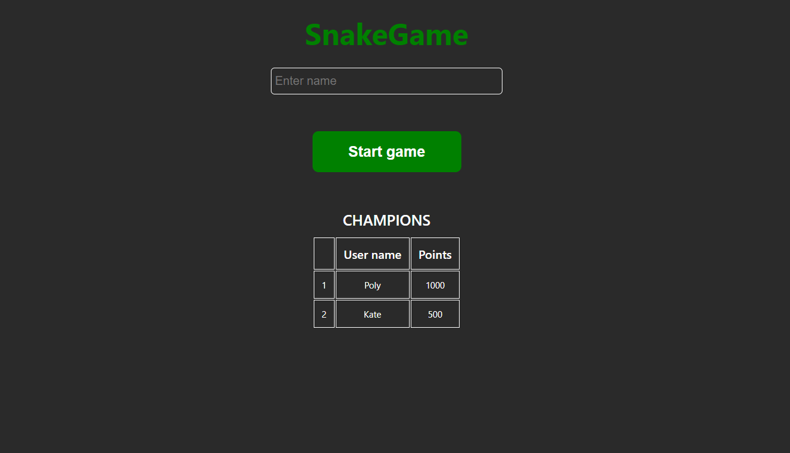
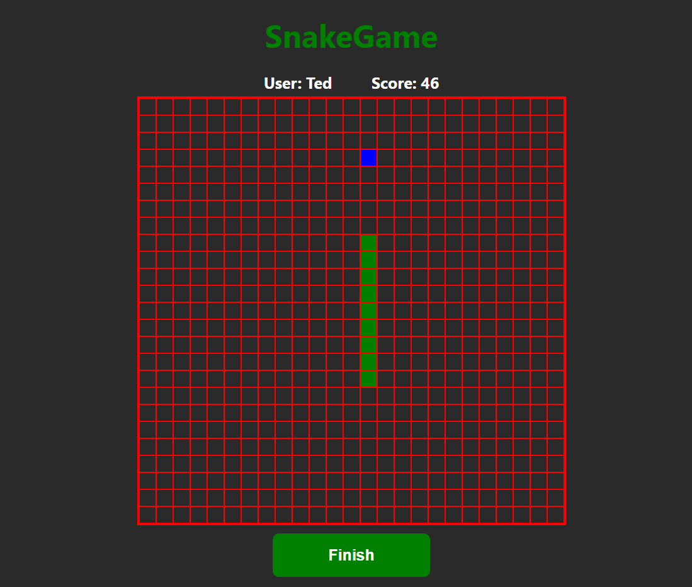
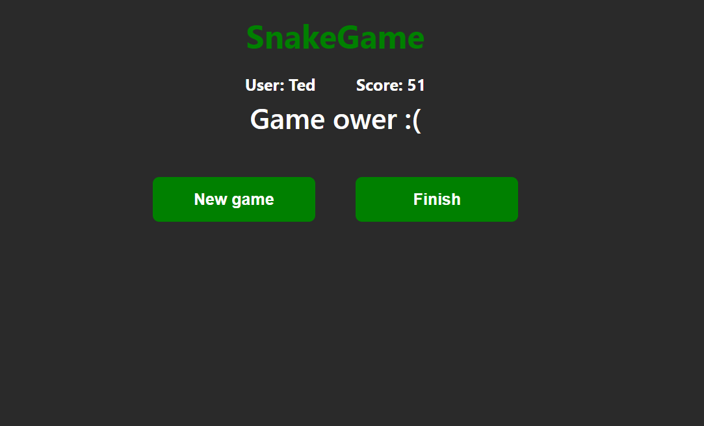

# SnakeGame

## Implemented Requirements

1. Input name
2. Counting points
3. List of record holders (max 5 users)
4. Snake`s move: left (ArrowLeft), right (ArrowRight), forward (ArrowUp), back (ArrowDown)
5. Pause/start (Space)
6. Game over, when snake crosses its body
7. Three types of feed
8. First 1 point (white color)
9. Second 5 point (blue color)
10. Third 10 point (orange color)
11. Every 50 point snake`s speed is increase

###

Enter a name and click the button "Start game".\
If the name is not entered, the game will not start and a warning will appear.\

The direction of movement of the snake is selected by the arrows on the keyboard.\
If you click on the button "Finish", the game will end, the player's result will be saved and the first screen will appear.\

Game over, when snake crosses its body.\
If you click on the button "Finish", the game will end, the player's result will be saved and the first screen will appear.\
If you click on the button "New game", a playing field will appear. The previous result will not be saved.

### `npm run build` fails to minify

This section has moved here: [https://facebook.github.io/create-react-app/docs/troubleshooting#npm-run-build-fails-to-minify](https://facebook.github.io/create-react-app/docs/troubleshooting#npm-run-build-fails-to-minify)
